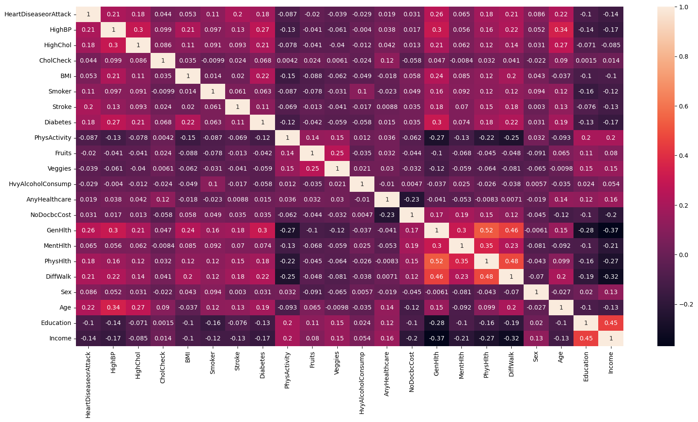

# Heart-Disease-Classification
**Objective**
The project involves developing a binary classification model using Keras to predict the presence of heart disease based on a dataset. 

**Dataset Description**
This dataset includes:  
Number of features: 21   
HighBP,HighChol,CholCheck,Smoker,Stroke,Diabetes,PhysActivity,Fruits,Veggies,HvyAlcoholConsump,AnyHealthcare,NoDocbcCost,GenHlth,MentHlth,PhysHlth,DiffWalk,Sex,Age,Education,Income, BMI  
2 classes: Binary classification  
HeartDiseaseorAttack  
0    229773  
1     23888  
Total Samples: 253661  

Correlation of features:  

 **Steps to run the code**
1. Download the ipynb file and the dataset file.  
2. Upload the notebook on Colab then upload the dataset.  
3. Run the whole code to see the results by yourself.  

 **Dependencies**
 Required libraries are Numpy, Pandas, Tensorflow, matplotlib, sklearn, and seaborn  
 To download keras tuner:   
 ! pip install keras-tuner --upgrade  
 To download tensorboard  
 ! pip install tensorboard  
 To run tensorboard open the terminal and type this command: tensorboard --logdir logs  
 Then tensorboard will serve on localhost.
 

